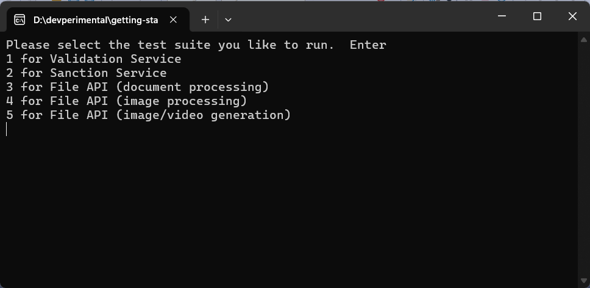

# Get started with the OnboardingBuddyClient

## 1 Create an OnboardingBuddy account 

If you have not already, navigate to the Onboarding Buddy website at https://www.onboardingbuddy.co.  Proceed to register and create an account.

## 2 Get you API credentials

Navigate to you application by clicking "View" on the dashboard.  making note of the following:

On the "Details" Tab make a note of your application key:
```
APP_KEY (Application Key)
```

And on the "Access Tokens" Tab make a note of your Api Key and Api Secret:
```
API_KEY (Api Key)
API_SECRET (Api Secret)
```

## 3 Save credentials to environment variables

Next create the following environment variables:

Windows
```
setx OB_APP_KEY <APP_KEY>
setx OB_API_KEY <API_KEY>
setx OB_API_SECRET <API_SECRET>
```

Linux
```
export OB_APP_KEY='<APP_KEY>'
export OB_API_KEY='<API_KEY>'
export OB_API_SECRET='<API_SECRET>'
```

## 3 Open the test application 
Open the project file for the console application after cloning this repo to your local machine.

```
OnboardingBuddyConsole.csproj
```

This application contains sample code that uses the <href="https://www.nuget.org/packages/OnboardingBuddyClient">C# Nuget Package</a> to call the Onboarding Buddy API. 

Note: the files required to run this demo are included in the dotnet folder.

```
exo-planets.pdf
eiffel-tower.jpg
```

To start the console application press F5 to run the API tests.  After launching you will be presented with 5 differents tests that can be run, listed below:

1 - Validation Tests
This includes examples calls for email, mobile, ip address and browser validation

2 - Sanction Tests
This includes examples calls for individual, entity, aircraft, vessel and  crypto wallet checks

3 - File Document Tests
This includes examples uploading a pdf, download, semantic search and RAG

4 - File Image Tests
This includes examples uploading a pdf, download, semantic search and video from image (Veo2) generation

5 - File Generation Tests
This includes examples creating a video (Veo3) and image (Imagen)  from a prompt

Select the desired test to run the respective code.



## 4 Questions and Help

If you have any questions or need any assistance please email us at support@onboardingbuddy.co